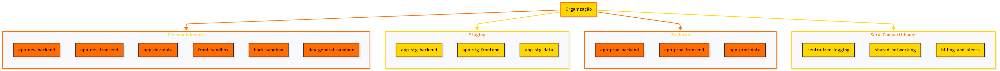

# Desafio DIO: Estrutura Organizacional de Pastas e Projetos no GCP

Este repositório apresenta a solução para o desafio do bootcamp "GCP Foundations" da [Digital Innovation One](https://www.dio.me/). O objetivo foi desenhar uma estrutura hierárquica e um modelo de organização de recursos para o Google Cloud Platform (GCP).

O projeto visa demonstrar uma abordagem para gerenciar múltiplos ambientes (Desenvolvimento, Homologação e Produção) de forma escalável e segura, otimizando a aplicação de políticas de acesso (IAM) para diferentes perfis, como desenvolvedores Frontend (João) e Backend (Ana), e outras equipes.

## Diagrama da Estrutura Proposta

A imagem abaixo ilustra a organização de pastas e projetos proposta, seguindo os princípios de segregação de ambientes e centralização de serviços compartilhados.

*O código-fonte do diagrama (formato Mermaid) está disponível na raiz deste repositório (`organizacao-gcp.mmd`) e pode ser visualizado e editado em plataformas como o [Mermaid Live Editor](https://mermaid.live/).*

### Conceitos Aplicados na Estrutura

-   **Organização (Raiz):** O ponto de partida de todos os recursos no GCP, essencial para a governança corporativa.
-   **Pastas por Ambiente:**
    -   **Desenvolvimento:** Contém projetos para o desenvolvimento ativo da aplicação (backend e frontend), além de sandboxes individuais para experimentação de desenvolvedores (João e Ana).
    -   **Homologação (Staging):** Ambiente de pré-produção para testes de integração e validação final antes do deploy em produção.
    -   **Produção:** Contém os projetos e recursos que servem aos usuários finais, com o mais alto nível de segurança e controle.
-   **Pasta de Serviços Compartilhados:** Agrupa projetos que fornecem serviços essenciais para toda a organização, como:
    -   `centralized-logging`: Para agregação e análise de logs.
    -   `shared-networking`: Para uma rede VPC compartilhada e outros recursos de rede.
    -   `billing-and-alerts`: Para gerenciamento de orçamentos e alertas de custos.
-   **Segregação de Responsabilidades:** A estrutura permite que os projetos de backend e frontend sejam isolados, facilitando a aplicação de permissões específicas para Ana (Backend) e João (Frontend) em seus respectivos domínios e ambientes.

## Nota sobre a Ferramenta de Diagramação

Embora o desafio sugerisse o uso do Draw.io, optei por desenvolver o diagrama utilizando a sintaxe [Mermaid](https://mermaid.js.org/).

**Motivação para o uso de Mermaid:**
-   **Versionamento Nativo:** O código Mermaid pode ser versionado diretamente no Git, facilitando o controle de mudanças e a colaboração entre equipes de engenharia.
-   **Diagramas como Código (Diagrams as Code):** Alinha-se às práticas modernas de Infraestrutura como Código (IaC) e de desenvolvimento, onde a infraestrutura e a documentação (incluindo diagramas) são gerenciadas via código.
-   **Integrar: [link para o seu perfil na DIO]ação Flexível:** Facilmente renderizado em diversas plataformas (como o próprio GitHub, GitLab, Confluence) diretamente do arquivo de markdown ou do arquivo `.mmd`.
-   **Manutenibilidade e Revisão:** Mais fácil de revisar, atualizar e manter consistente com as mudanças do projeto, pois é texto puro.

O diagrama PNG foi gerado a partir do código Mermaid para facilitar a visualização por quem não tem um renderizador Mermaid nativo.

## Ferramentas e Conceitos Utilizados

-   **Diagrama:** Mermaid (gerado a partir de código)
-   **Controle de Versão:** Git & GitHub
-   **Google Cloud Platform (GCP):** Organização, Pastas, Projetos, IAM.

## Autor

-   **Sthefany Silva**
-   **LinkedIn:** [https://www.linkedin.com/in/sthefany-rodrigues-silva-11464129a/](https://www.linkedin.com/in/sthefany-rodrigues-silva-11464129a/)
-   **Perfil DIO:** [https://web.dio.me/users/sthefanysilvaakn](https://web.dio.me/users/sthefanysilvaakn)
